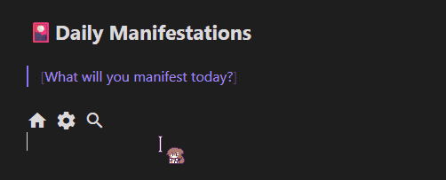

# Material Icons Inline

Render Google Material Icons in Obsidian using the `!icon[name]` markdown syntax.

## Demo



*Note: The animated mouse cursor seen in the demo is by [Haku](https://booth.pm/ja/items/7836614).*

## Features

- **Live Preview** — icons render as you type; click to reveal raw syntax, click away to render again
- **Reading view** — icons render in reading view and exported notes
- **2,500+ icons** — full Google Material Icons library
- **Simple syntax** — `!icon[home]`, `!icon[settings]`, `!icon[check_circle]`
- **Configurable** — set any CSS size or color via plugin settings
- **Works offline** — the icon font is bundled with the plugin; no network requests, no API key

## Installation

### Via Community Plugins (recommended)

1. Open Obsidian → **Settings → Community plugins → Browse**
2. Search for **Material Icons Inline**
3. Click **Install**, then **Enable**

### Manual

1. Download `main.js`, `manifest.json` and `styles.css` from the [latest release](https://github.com/meiorz/material-icons-obsidian/releases/latest)
2. Copy the three files to `<vault>/.obsidian/plugins/material-icons-inline/`
3. Enable the plugin under **Settings → Community plugins**

### Build from Source

```bash
git clone https://github.com/meiorz/material-icons-obsidian
cd material-icons-obsidian
npm install
npm run build
```

Copy `main.js`, `manifest.json` and `styles.css` to your vault's plugin folder.

## Usage

### Syntax

```
!icon[icon_name]
```

Icon names are lowercase with underscores, matching the names shown on the Google Material Icons site.

### Examples

```markdown
!icon[home] Home
!icon[settings] Settings
!icon[search] Search
!icon[check_circle] Task completed
!icon[error] Something went wrong
!icon[arrow_forward] Next  !icon[arrow_back] Previous
```

### Finding Icon Names

1. Visit [Google Material Icons](https://fonts.google.com/icons)
2. Search for the icon you want
3. Copy the name shown below it — uses underscores, all lowercase
4. Example: "Check Circle" → `!icon[check_circle]`

## Live Preview Behavior

In the editor, icons behave like Obsidian's image embeds:

| State | What you see |
|---|---|
| Cursor elsewhere | Rendered icon |
| Cursor inside `!icon[...]` | Raw syntax |

This lets you edit the icon name without switching modes.

## Settings

Access via **Settings → Material Icons Inline**.

| Setting | Default | Accepts |
|---|---|---|
| Icon Size | `24px` | Any CSS length: `16px`, `1.5em`, `2rem` |
| Icon Color | `currentColor` | Any CSS color: `red`, `#ff0000`, `rgb(255,0,0)` |

Invalid values fall back to the default silently.

## How It Works

1. **Font loading** — The Material Icons font is embedded in `styles.css` (generated at build time from `styles.src.css`), which Obsidian loads and unloads with the plugin. No network requests are made.
2. **Live Preview** — A CodeMirror 6 `ViewPlugin` scans visible text for `!icon[name]` patterns and replaces them with `Decoration.replace` widgets. Decorations are removed when the cursor enters the token range, revealing the raw syntax.
3. **Reading view** — A markdown post-processor uses `TreeWalker` to find text nodes and replaces each match with an `<i class="material-icons-inline">` element via `DocumentFragment`.
4. **Styling** — Icon size and color are passed to `styles.css` as the CSS variables `--material-icons-inline-size` and `--material-icons-inline-color`.

## Customization

### Change the Syntax

Edit the regex in `parseAndCreateIconHTML()` and `buildDecorations()` in `main.ts`:

```typescript
// Current: !icon[home]
const iconRegex = /!icon\[([a-z0-9_]+)\]/g;

// Alternative: {{icon:home}}
const iconRegex = /{{icon:([a-z0-9_]+)}}/g;
```

### Change Default Size or Color

Edit `DEFAULT_SETTINGS` in `main.ts`:

```typescript
const DEFAULT_SETTINGS: MaterialIconsSettings = {
    iconSize: '20px',
    iconColor: 'currentColor'
}
```

## Testing

```bash
npm test              # run all tests
npm run test:watch    # watch mode
npm run test:coverage # coverage report
```

## Troubleshooting

### Icons not showing in editor

- Confirm the plugin is enabled under **Settings → Community plugins**
- Make sure you are in **Live Preview** mode, not Source mode (Source mode does not render decorations)
- Reload the vault with `Ctrl+R`

### Icons not showing in reading view

- Make sure `styles.css` is in the plugin folder next to `main.js` (it contains the icon font)
- Reload the vault with `Ctrl+R`

### Wrong icon appears

- Double-check the name at [Google Material Icons](https://fonts.google.com/icons)
- Names must be lowercase with underscores: `check_circle` not `check circle` or `Check_Circle`

### Settings change not reflected

- Settings apply on next render; toggle reading view or move the cursor out of the icon token to refresh

## Common Icons

| Syntax | Description |
|---|---|
| `!icon[home]` | Home |
| `!icon[settings]` | Settings |
| `!icon[search]` | Search |
| `!icon[edit]` | Edit |
| `!icon[delete]` | Delete |
| `!icon[check_circle]` | Done / Completed |
| `!icon[error]` | Error |
| `!icon[warning]` | Warning |
| `!icon[info]` | Information |
| `!icon[favorite]` | Favorite |
| `!icon[bookmark]` | Bookmark |
| `!icon[arrow_forward]` | Next |
| `!icon[arrow_back]` | Previous |
| `!icon[download]` | Download |
| `!icon[upload]` | Upload |
| `!icon[star]` | Star |

[Browse all 2,500+ icons](https://fonts.google.com/icons)

## Acknowledgements

* **Mouse Cursor:** The 戌神ころね (Inugami Korone) animated mouse cursor seen in `demo.gif` is created by [Haku](https://haku15937.booth.pm/) and is not affiliated with this plugin. You can download the cursor [here](https://booth.pm/ja/items/7836614).

* **Icon font:** [Material Icons](https://github.com/google/material-design-icons) by Google, licensed under the [Apache License 2.0](https://www.apache.org/licenses/LICENSE-2.0). The font is bundled from the [`material-icons`](https://www.npmjs.com/package/material-icons) npm package.

## License

MIT

## Author

[meiorz](https://github.com/meiorz)

## Contributing

Pull requests and issues welcome.
